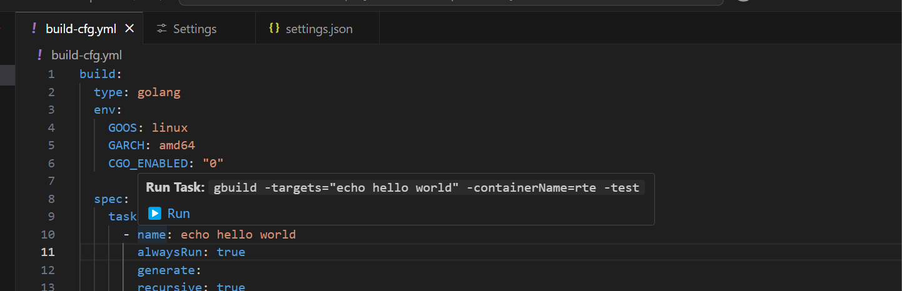
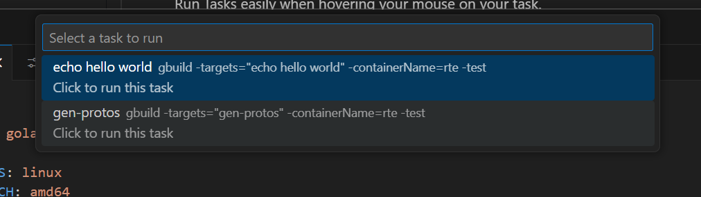

# Yaml Task Runner

Run Tasks easily when hovering your mouse on your task.

## Features

* Hovering over tasks to show run command

* List of available tasks by running `Show Yaml Tasks`

## Requirements

It will run automatically upon installing when opening (yaml,yml) files.

Currently, yaml file needs to follow specific scheme. Task should be in `build.spec.tasks.name`

`Tasks` is an array.

## Extension Settings

The following settings can be configured:-

This extension contributes the following settings:

* `yaml-task-runner.tool`: Tool to be used when running the task. eg. 'docker', 'docker-compose', 'kubectl', 'helm', 'kustomize', 'terraform', etc.
* `yaml-task-runner.mainFlag`: Add the task name in a flag. Leave empty if you want to run the task directly. eg. docker run -name '<task-name>'
* `yaml-task-runner.additionalFlags`: Additional Flags to be added. eg. docker run -name '<task-name>' -rm -interactive.
* `yaml-task-runner.exportToFile`: Add '> <filename>' at the end of the command to export the output to a file. eg. docker run -name '<task-name>' > <filename>
* `yaml-task-runner.taskPath`: Path to the tasks array in the YAML file (e.g., 'build.spec.tasks').
* `yaml-task-runner.identifierField`: Field name used to identify tasks (e.g., 'name').

## Known Issues

-

## Release Notes

### 0.0.2
* Replaced Terminal name when running task to just task name

### 0.0.2

* Added exportToFile option.
* Made default scheme for yaml files configurable.
* Showing/Hiding Yaml Task Runner status bar based on the opened tab whether it's `.yml` or `.yaml`

### 0.0.1

Initial release of Yaml Task Runner

---
